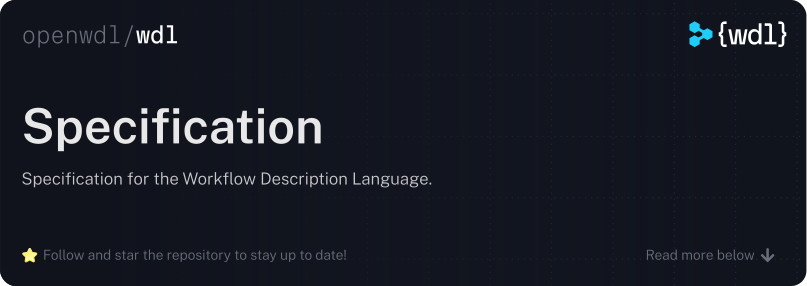

  

 

The **Workflow Description Language (WDL)** (pronounced as _/hwɪdl/_ or "whittle" with a 'd') is an open standard for describing data processing workflows using a human-readable/writeable syntax.
It introduces a domain-specific language that aims to provide simple but powerful facilities for (a) defining atomic units of computation (a `task`), (b) for connecting those atomic units together into a larger computation graph (a `workflow`), and (c) for effortlessly scaling the execution of these graphs in multiple environments.

Most fundamentally, WDL differentiates itself from other workflow languages by focusing on ease of implementation and accessibility to a wide range of users, including software engineers, domain experts (e.g., biologists), and operators of production computational systems.
Furthermore, idiomatic workflow execution patterns, such as conditional execution, dynamic resource allocation, and scatter-gather operations, are simply expressed.
Last, the language is driven and developed by a community of distributed volunteers as an open standard;
there is no single execution engine, and anyone can build tooling to contribute to the ecosystem.
Today, [several engines and platforms] exist and cover most execution environments (all major HPCs, all major clouds, local execution).

## Join the community

If you're new to WDL, welcome 👋. We _highly_ recommend that you read the [getting started documentation] to learn how to write tasks and workflows.

The WDL community depends on your involvement to thrive.
You are encouraged to [ask questions], help other users, and make contributions where you can.
Interactions occur primarily on [GitHub][github-main] and [Slack][join-slack].
The WDL community also has an official [website](https://openwdl.org/) and [blog](https://openwdl.org/blog/) that you can follow to stay up to date.

## Specification

The WDL specification contains all relevant information for users and developers, including those wanting to implement an execution engine.
This GitHub project uses the branch for the current version of the specification as its primary branch, so you will always see the current version of the specification so long as you visit this project's [root URL][github-main].
Users are strongly encouraged to use the current version of the specification unless absolutely necessary.

* This branch is for version `1.2` of the specification ([link](https://github.com/openwdl/wdl/blob/wdl-1.2/SPEC.md)). All development of new *non-breaking* features should be done against this branch.
* The next major version of the specification is version `2.0` ([link](https://github.com/openwdl/wdl/blob/wdl-2.0/SPEC.md)). All development of new *breaking* features should be done against that branch.

If desired, previous versions of the spec can be found on the [GitHub branches page][github-branches].

### Versioning

All products of the WDL project, including the specification, follow [semantic versioning](https://semver.org).
That being said, the version of the WDL _language_ and the version of the WDL _specification_ are distinct:

* The WDL _language_ has a two-number version (e.g., `1.2`). An increase in the minor (second) version number (e.g., `1.1` to `1.2`) indicates the addition of, or non-breaking changes to, the language or standard library functions. An increase in the major (first) version number (e.g., `1.0` to `2.0`) indicates that breaking changes have been made.

* The WDL _specification_ has a three-number version (e.g., `1.2.0`). The specification version tracks the language version, but there may also be patch releases (indicated by a change to the patch, or third, version number) that include fixes for typos, additional examples, or non-breaking clarifications of ambiguous language.

### Contributing

WDL only advances through community contributions.
While participating in discussions and submitting issues are great ways to be involved, help is also needed to implement changes to the specification.
For more information on how you can contribute, please read the [Contributing] guide.

### Governance

The WDL specification is entirely community driven;
however, it is overseen by a [governance committee and process].
If you are interested in being involved in WDL governance, please join the [Slack][join-slack] and post a message in the `#general` channel.

### License

The WDL specification is made available to you under the permissive [BSD 3-Clause License](./LICENSE).

© 2024-Present The OpenWDL Developers

[github-main]: https://github.com/openwdl/wdl
[github-branches]: https://github.com/openwdl/wdl/branches
[github-issues]: https://github.com/openwdl/wdl/issues
[join-slack]: https://join.slack.com/t/openwdl/shared_invite/zt-ctmj4mhf-cFBNxIiZYs6SY9HgM9UAVw
[wdl-docs]: https://docs.openwdl.org/en/stable
[Contributing]: https://github.com/openwdl/governance/blob/main/CONTRIBUTING.md
[several engines and platforms]: https://docs.openwdl.org/getting-started/ecosystem.html
[getting started documentation]: https://docs.openwdl.org/getting-started/quickstart.html
[contributing]: https://github.com/openwdl/governance/blob/main/CONTRIBUTING.md
[governance committee and process]: https://github.com/openwdl/governance/blob/main/README.md
[ask questions]: https://docs.openwdl.org/getting-started/getting-help.html
